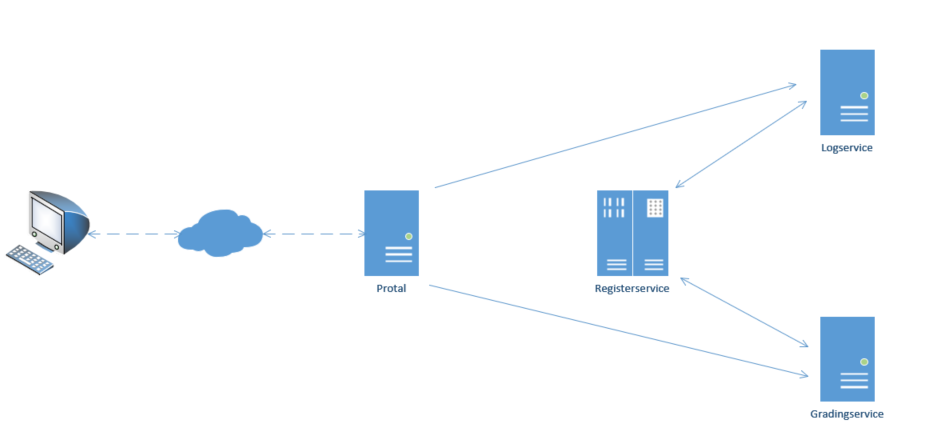

# golang Implemented Simple Distributed System

[comment]: <> "[![Build Status]&#40;https://travis-ci.org/reggiepy/distributed.svg?branch=master&#41;]&#40;https://travis-ci.org/reggiepy/distributed&#41;"

[comment]: <> "[![Coverage Status]&#40;https://coveralls.io/repos/github/reggiepy/distributed/badge.svg?branch=master&#41;]&#40;https://coveralls.io/github/reggiepy/distributed?branch=master&#41;"

[comment]: <> ([![go version]&#40;https://img.shields.io/badge/go-1.16-success.svg?style=flat&#41;]&#40;&#41;)

[]()
[]()
[]()
[]()
[]()
[](https://goreportcard.com/report/github.com/reggiepy/distributed)

## Installation

```bash
git clone https://github.com/reggiepy/distributed.git
go mod tidy
cd distributed
```

## Usage

```bash
go run cmd/registryservice/main.go
go run cmd/logservice/main.go
go run cmd/gradingservice/main.go
go run cmd/portal/main.go
```

## Architecture

